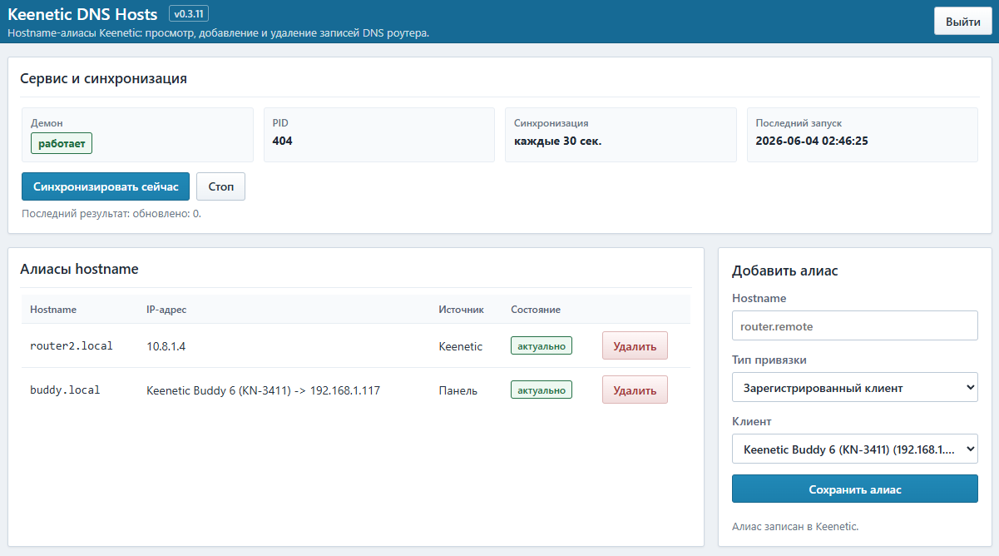

# Keenetic DNS Hosts

Веб-панель для управления локальными hostname-алиасами на роутерах Keenetic через Entware.

Keenetic DNS Hosts позволяет добавлять, просматривать и удалять записи `ip host` прямо из браузера. Панель запускается на самом роутере, использует логин и пароль Keenetic для входа и работает с конфигурацией роутера через локальный RCI.



Проект не является официальным компонентом KeeneticOS и не связан с Keenetic.

## Статус проекта

Keenetic DNS Hosts находится в beta-стадии. Проект уже можно использовать, но он развивается и может содержать ошибки.

Устанавливайте и используйте панель на свой страх и риск. Перед изменением DNS-записей убедитесь, что понимаете, какие hostname и IP-адреса добавляете. Автор не несет ответственности за возможные сбои сети, потерю доступа к устройствам, ошибки конфигурации или другие последствия использования проекта.

## Возможности

- просмотр hostname-алиасов из конфигурации Keenetic;
- добавление алиаса вручную по IPv4-адресу;
- добавление алиаса по зарегистрированному клиенту Keenetic с привязкой к MAC-адресу;
- автоматическое обновление client-алиасов при смене IP у клиента;
- удаление алиасов из DNS-конфигурации роутера;
- автоматическое сохранение конфигурации Keenetic после изменений;
- вход в панель по учетным данным Keenetic;
- просмотр статуса фоновой синхронизации и управление ею из панели;
- ручной запуск синхронизации, а также старт и остановка фоновой синхронизации без остановки веб-панели;
- отображение версии панели в заголовке;
- автообновление списков клиентов и алиасов без перезагрузки страницы;
- установка как Entware-пакет.

## Требования

- роутер Keenetic с установленным Entware;
- проект тестировался на KeeneticOS 5.1 Beta 4; скорее всего, будет работать и на KeeneticOS 5.0.11;
- установленный `python3`;
- доступный локальный RCI Keenetic `http://localhost:79/rci`;
- пользователь Keenetic с правами на изменение конфигурации.

## Установка

```sh
opkg update
opkg install curl
curl -fsSL https://raw.githubusercontent.com/Manless88/keenetic-dns-hosts/main/scripts/install.sh | sh
```

Во время установки можно выбрать порт веб-панели. Если просто нажать Enter, будет использован порт `3333`.

После установки панель будет доступна по адресу:

```text
http://<router-ip>:3333/
```

Если выбран другой порт, используйте его вместо `3333`.

## Вход в панель

Используйте логин и пароль от веб-интерфейса Keenetic.

Пароль не сохраняется в конфиге приложения и не хранится в веб-сессии. Он используется только в момент входа для проверки через Keenetic `/auth`.

## Как это работает

Панель читает записи `ip host` из Keenetic и показывает их в таблице:

- `Панель` - алиас был добавлен через Keenetic DNS Hosts;
- `Keenetic` - алиас уже был в конфигурации роутера.

Алиасы можно добавлять вручную по IP-адресу или привязывать к зарегистрированному клиенту Keenetic. При привязке к клиенту панель сохраняет MAC-адрес устройства, а фоновая синхронизация периодически проверяет текущий IP клиента и обновляет DNS-запись, если адрес изменился.

Кнопки `Старт` и `Стоп` в панели управляют только фоновой синхронизацией. Веб-панель при этом продолжает работать.

При добавлении алиаса панель записывает в Keenetic команду, эквивалентную:

```text
ip host <hostname> <ip>
```

При удалении:

```text
no ip host <hostname> <ip>
```

После изменений конфигурация роутера сохраняется автоматически.

## Обновление

Запустите установку повторно:

```sh
curl -fsSL https://raw.githubusercontent.com/Manless88/keenetic-dns-hosts/main/scripts/install.sh | sh
```

## Управление сервисом

```sh
/opt/etc/init.d/S89keenetic-dns-hosts start
/opt/etc/init.d/S89keenetic-dns-hosts stop
/opt/etc/init.d/S89keenetic-dns-hosts restart
/opt/etc/init.d/S89keenetic-dns-hosts status
```

Лог сервиса:

```text
/opt/var/log/keenetic-dns-hosts.log
```

Конфигурация:

```text
/opt/etc/keenetic-dns-hosts.conf
```

## Удаление

Полное удаление проекта с роутера:

```sh
curl -fsSL https://raw.githubusercontent.com/Manless88/keenetic-dns-hosts/main/scripts/uninstall.sh | sh
```

Скрипт удаляет пакет, сервис, файлы приложения, конфигурацию, локальные данные и лог.

DNS-алиасы, уже записанные в Keenetic как `ip host`, являются настройками самого роутера и не удаляются автоматически. Если их нужно убрать, удалите их в панели до деинсталляции или вручную через CLI Keenetic.

## Поддержать проект

Если Keenetic DNS Hosts оказался полезным, можно поддержать проект звездой на GitHub. А если хочется сказать автору спасибо более тепло, можно [угостить его кофе](https://yoomoney.ru/to/41001721343570).

## Лицензия

MIT
